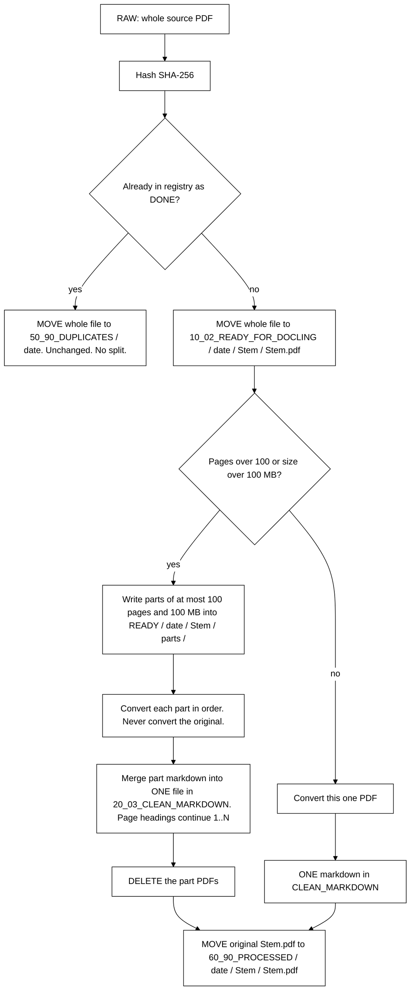

# Satyagraha Law Group

**PDF to Markdown**  ·  SLIP  ·  Legal Research  ·  Practitioner-Scholar

आ नो भद्राः क्रतवो यन्तु विश्वतः

*Let noble thoughts come to us from every side. — Rig Veda*

*The law is reason, free from passion.*

[https://www.satyagraha.com](https://www.satyagraha.com)

> This is a research project at Satyagraha Law Group as part of its pursuit of excellence in legal research. It is not legal advice, not a solicitation, and not an offer to represent anyone.

---

This is the SLIP PDF to Markdown Ingestion Tool for legal PDFs. It does not summarise, argue, or invent cells. It turns a PDF into Markdown you can open, search, and hand to an LLM.

## Lawyer use (three steps)

1. **Put PDFs in** `0_01_RAW_PDF`
2. **Run convert** — you will be asked to pick an engine (1 local Tesseract, 2 MistralAI)
3. **Open** `20_03_CLEAN_MARKDOWN`

That is the whole product for a lawyer: **Drop PDF → Choose engine → Wait → Open Markdown**.

On a successful convert the original PDF is moved to `60_90_PROCESSED / YYYY-MM-DD / Stem / Stem.pdf`. Duplicates are never deleted. SHA-256 is identity, not the filename.

## Convert happy path

At `10_02_READY_FOR_DOCLING` the tool looks at page count and size. Anything over **100 pages** or **100 MB** is split so that no convert job is over that cap.

- The original PDF is not converted when it is over the cap. Only the parts are.
- After a clean convert the part markdown is merged into **one** file in `20_03_CLEAN_MARKDOWN`. Page headings continue `## Page 1` .. `N`.
- The part PDFs are then **deleted**.
- The untouched original is moved to `60_90_PROCESSED / YYYY-MM-DD / Stem / Stem.pdf`.
- A duplicate (same SHA-256 already `DONE`) skips the split. The whole file moves unchanged into `50_90_DUPLICATES / YYYY-MM-DD`.




Convert prints percent complete as it works, then a short session recap. The detailed session log is a three-word-named markdown file under `90_00_PROJECT_TOOLING/pdf-to-markdown/logs/`.

## Engines

In a terminal, `slip-pdf-md convert` always asks which engine to use. That includes a first convert and a `--force` reconvert.

1. **Local Tesseract** — stays on this computer. Use for privileged papers.
2. **Mistral AI** — uploads the PDF. Stronger on tables and formulas. Needs `SECRETS.txt`. See [[Mistral-Engine-Guide]] and [[Marker-Mistral-Engine]].

Scripts and CI pass `--engine pymupdf` or `--engine mistral` because they have no terminal. A lawyer at a keyboard is always asked.

## CLI

```bash
python -m venv .venv
# Windows: .venv\Scripts\activate
pip install -e ".[dev]"
slip-pdf-md doctor --vault "PATH/TO/SLIP_DOCUMENT_PROCESSING"
slip-pdf-md convert --vault "PATH/TO/SLIP_DOCUMENT_PROCESSING" --repair-citations
slip-pdf-md verify --markdown "PATH/TO/file.md" --pdf "PATH/TO/file.pdf"
slip-pdf-md audit --vault "PATH/TO/SLIP_DOCUMENT_PROCESSING"
```

`--force` reconverts a DONE hash. `--input` points at one file or folder. If that file sits in `0_01_RAW_PDF` and convert succeeds, it is moved to `60_90_PROCESSED`.

## Playbooks

1. [Deploy scaffold](playbooks/01-Deploy-Scaffold.md) — [[README]]
2. [Convert documents](playbooks/02-Convert-Documents.md)
3. [Audit quality](playbooks/03-Audit-Quality.md)
4. [Handle duplicates](playbooks/04-Handle-Duplicates.md)
5. [Repair markdown](playbooks/05-Repair-Markdown.md)

GitHub repository: https://github.com/Satyagraha-Law-Group/pdf-to-markdown

## SLIP folders

| Folder | Role |
| --- | --- |
| `0_01_RAW_PDF` | Drop zone. Convert empties this sequentially |
| `10_02_READY_FOR_DOCLING` | Ready-for-conversion queue (`YYYY-MM-DD / Stem / Stem.pdf`). Split parts live in `Stem / parts /` and are deleted after a clean merge |
| `20_03_CLEAN_MARKDOWN` | Faithful Markdown |
| `30_04_CASE_BRIEFS` | Layer 2, out of scope |
| `40_05_PROJECT_BRIEFS` | Layer 2, out of scope |
| `50_90_DUPLICATES` | Same SHA-256, dated buckets. Duplicates are not copied to processed |
| `60_90_PROCESSED` | Successful unique converts (`YYYY-MM-DD / Stem / Stem.pdf`) |
| `70_99_NEEDS_REVIEW` | Extract the engine will not stand behind |
| `90_00_PROJECT_TOOLING` | Registry, logs, session summaries |
| `Convert-PDF-TO-MARKDOWN-01` | Working copy of this product |

## Tests

```bash
pytest
python scripts/verify_markdown.py --markdown PATH.md --pdf PATH.pdf
```


## GUBERNATIO

**GUBERNATIO** is the proper Latin noun meaning *the system of governance, steering, direction, and administration*.

It is a table inside the Document-Hash-Registry sqlite. After SHA-256, every file (including a hash already `DONE`) gets a GUBERNATIO row with **this filename** and the registry-like fields (status, engine, pages, path, host, agent, step). `documents` stays one row per hash so several agents, on several devices, do not clog identity. When convert finishes, both `documents` and GUBERNATIO are updated.

```bash
slip-pdf-md registry gubernatio --vault "PATH/TO/SLIP_DOCUMENT_PROCESSING"
```

See [[Slip-Markdown-Glossary]].

## Duplicate identity (SHA-256)

The filename is not identity. Convert hashes the PDF bytes (SHA-256) and stores one row per unique hash in:

`90_00_PROJECT_TOOLING/pdf-to-markdown/Document-Hash-Registry-vN-DD-MM-YYYY-HH-MI-SS.sqlite` (stamp is first-created time; the file is not renamed on later writes)

A sibling `.bak` with the same three-word stem is rewritten after every successful change. `Registry-Safety-Notice-vN-…txt` sits next to them: do not delete either copy.

Six months later a renamed drop of the same bytes prints `[DUP]` on the terminal with the first filename, first-seen date, engine, page count, canonical markdown path, and how many times this hash has been seen.

If the live sqlite is deleted, the next convert or `doctor` restores it from the matching `.bak` automatically.

If both copies are corrupt or gone:

```bash
slip-pdf-md registry status --vault "PATH"
slip-pdf-md registry restore --vault "PATH"
slip-pdf-md registry rebuild --vault "PATH"
```

`rebuild` reconstructs the registry from Markdown front matter in `20_03_CLEAN_MARKDOWN` (and sightings from duplicate sidecars and leftover PDFs). `--force` reconverts even when the hash is already `DONE`.

## Confidentiality

Client PDFs and `SECRETS*` never belong in git. The public repository is the tool, not the evidence.

<!-- Related documents: Obsidian wiki links AND GitHub relative links -->
<!-- [[README]] [[Mistral-Engine-Guide]] [[Marker-Mistral-Engine]] [[Product-Requirements-Spec]] [[System-Design-Document]] [[Implementation-Plan-Guide]] [[System-Architecture-Diagram]] [[Process-Workflow-Guide]] -->

## Related documents

- [[README]] — [Product overview](README.md)
- [[Mistral-Engine-Guide]] — [Lawyer user guide](docs/Mistral-Engine-Guide-v1-03-09-2026-04-39-31.md)
- [[Marker-Mistral-Engine]] — [Mistral engine mapping](docs/Marker-Mistral-Engine-v1-03-09-2026-04-05-21.md)
- [[Product-Requirements-Spec]] — [Requirements](docs/Product-Requirements-Spec-v1-02-09-2026-22-55-00.md)
- [[System-Design-Document]] — [Design](docs/System-Design-Document-v1-02-09-2026-22-55-00.md)
- [[Implementation-Plan-Guide]] — [Plan](docs/Implementation-Plan-Guide-v1-02-09-2026-22-55-00.md)
- [[System-Architecture-Diagram]] — [Architecture](docs/System-Architecture-Diagram-v1-02-09-2026-22-55-00.md)
- [[Process-Workflow-Guide]] — [Workflow](docs/Process-Workflow-Guide-v1-02-09-2026-22-55-00.md)

---

Satyagraha Law Group publishes a SLIP PDF to Markdown Ingestion Tool. It does not publish a library.

**Satyagraha Law Group**  ·  SLIP PDF to Markdown Ingestion Tool  ·  SLIP

Founded by Anil B. (Lawyer), Satyagraha Law Group provides legal services for seekers looking for help by searching for Corporate Law, Civil Law, Criminal Law, Writs, High Court Lawyer, NRI Lawyer, Lawyer In Hyderabad, India.

Need Legal Help. [Click here](https://calendly.com/anil-satyagraha/15min).

आ नो भद्राः क्रतवो यन्तु विश्वतः

*Let noble thoughts come to us from every side. — Rig Veda*

*The law is reason, free from passion.*

> This is a research project at Satyagraha Law Group as part of its pursuit of excellence in legal research. It is not legal advice, not a solicitation, and not an offer to represent anyone.

[https://www.satyagraha.com](https://www.satyagraha.com)

This site is built from **real-world experience helping clients seeking Justice**, case by case — based on our work involving Legal Research, Drafting, Pleadings, Representation and beyond.

Explore further: [Website](https://www.satyagraha.com) · [YouTube](https://www.youtube.com/@satyagrahalawgroup2002) · [Udemy Courses](https://www.udemy.com/user/anil-b-23/) · [LinkedIn](https://www.linkedin.com/in/anilsatyagraha/) · [Facebook](https://www.facebook.com/satyagrahalawgroup) · [Twitter / X](https://twitter.com/_satyagraha) · [WordPress](https://satyagrahalawgroup.wordpress.com/) · [Instagram](https://www.instagram.com/satyagrahalawgroup/) · [Pinterest](https://in.pinterest.com/satyagrahalawgroup/) · [Tumblr](https://www.tumblr.com/blog/satyagrahalawgroup) · [SoundCloud](https://soundcloud.com/satyagrahalawgroup) · [Podomatic](http://anil-satyagraha.podomatic.com/) · [Newsletter](https://satyagraha.substack.com/) · [WhatsApp](https://api.whatsapp.com/send?phone=917095776633)

Need Legal Help? [Click Here For Next Steps](https://calendly.com/anil-satyagraha/15min)
