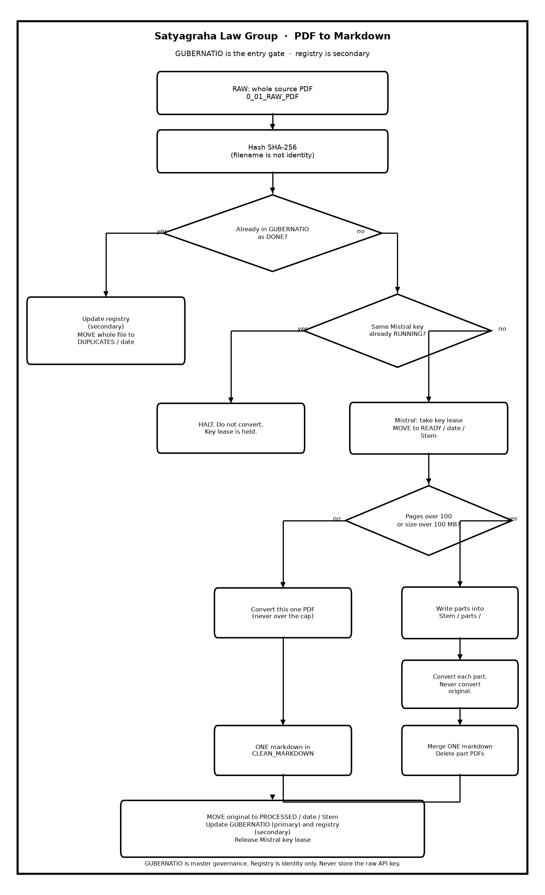

# Satyagraha Law Group

**PDF to Markdown**  ·  SLIP  ·  Legal Research  ·  Practitioner-Scholar

आ नो भद्राः क्रतवो यन्तु विश्वतः

*Let noble thoughts come to us from every side. — Rig Veda*

*The law is reason, free from passion.*

[https://www.satyagraha.com](https://www.satyagraha.com)

> This is a research project at Satyagraha Law Group as part of its pursuit of excellence in legal research. It is not legal advice, not a solicitation, and not an offer to represent anyone.

---
<!-- Related documents: Obsidian wiki links AND GitHub relative links -->
<!-- [[README]] [[Mistral-Engine-Guide]] [[Marker-Mistral-Engine]] [[Product-Requirements-Spec]] [[System-Design-Document]] [[Implementation-Plan-Guide]] [[System-Architecture-Diagram]] [[Process-Workflow-Guide]] -->

## Related documents

- [[README]] — [Product overview](../README.md)
- [[Mistral-Engine-Guide]] — [Lawyer user guide](Mistral-Engine-Guide-v1-03-09-2026-04-39-31.md)
- [[Marker-Mistral-Engine]] — [Mistral engine mapping](Marker-Mistral-Engine-v1-03-09-2026-04-05-21.md)
- [[Product-Requirements-Spec]] — [Requirements](Product-Requirements-Spec-v1-02-09-2026-22-55-00.md)
- [[System-Design-Document]] — [Design](System-Design-Document-v1-02-09-2026-22-55-00.md)
- [[Implementation-Plan-Guide]] — [Plan](Implementation-Plan-Guide-v1-02-09-2026-22-55-00.md)
- [[System-Architecture-Diagram]] — [Architecture](System-Architecture-Diagram-v1-02-09-2026-22-55-00.md)
- [[Process-Workflow-Guide]] — [Workflow](Process-Workflow-Guide-v1-02-09-2026-22-55-00.md)
# Mistral Engine Guide

Satyagraha Law Group — PDF to Markdown (SLIP)

Lawyer-facing guide for converting PDFs to Markdown. Default conversion stays on this computer. MistralAI OCR is optional and only runs when you ask for it.

## Three steps

1. Put PDFs in `0_01_RAW_PDF`
2. Run convert
3. Open `20_03_CLEAN_MARKDOWN`

**Drop PDF → Choose engine → Wait → Open Markdown.**

After SHA-256, **GUBERNATIO** (Latin: *the system of governance, steering, direction, and administration*) records this filename so several agents do not clog `documents`. A file over 100 pages or 100 MB is split at Ready for Doc Link so no convert job is over that cap. You still get one markdown. Part PDFs are deleted after a clean merge. The original PDF goes to `60_90_PROCESSED / YYYY-MM-DD / Stem / Stem.pdf`.



## Two engines

| Engine | Command | Leaves the machine? | Use when |
| --- | --- | --- | --- |
| Local Tesseract (default) | `--engine pymupdf` | No | Everyday scans, privileged papers |
| MistralAI OCR | `--engine mistral` | Yes. The PDF is uploaded | Hard scans, tables, formulas |

Mistral is the same option the [Obsidian OCR-AI plugin](https://community.obsidian.md/plugins/marker-api) recommends.

## One-time setup for Mistral

1. Create an API key at [console.mistral.ai/api-keys](https://console.mistral.ai/api-keys)
2. Open `SECRETS.txt` in the converter folder (`Convert-PDF-TO-MARKDOWN-01`). Setup creates this file with a dummy value. It is **gitignored**.
3. Replace the dummy with your key:

```text
MISTRAL_API_KEY=paste-your-real-key-here
```

You can also use a timestamped drop file named `SECRETS-DD-MM-YYYY HH-MI-SS.txt` in the same folder, or a `setx MISTRAL_API_KEY "…"` line. The converter reads those shapes.

4. Confirm:

```text
slip-pdf-md doctor --vault "D:\satyagraha\VAULT\Satyagraha Law Group\SLIP_DOCUMENT_PROCESSING"
```

Doctor should say `mistral_api_key: set (SECRETS file)` or `set (environment)`. If it still says dummy placeholder, the real key is not in `SECRETS.txt` yet.

### Never commit secrets

- Real keys live only in `SECRETS.txt` or `SECRETS-*.txt`
- `.gitignore` blocks `SECRETS`, `SECRETS.txt`, and `SECRETS-*`
- `SECRETS.example` is the dummy template that *is* allowed in git
- `init` / setup recreates the dummy `SECRETS.txt` if it is missing, and never overwrites a real file

Do not put a real key in `SECRETS.example`, README, chat logs, or GitHub.

## Convert a file

Local (nothing uploaded):

```text
slip-pdf-md convert --vault "D:\satyagraha\VAULT\Satyagraha Law Group\SLIP_DOCUMENT_PROCESSING" --input "D:\satyagraha\VAULT\Satyagraha Law Group\SLIP_DOCUMENT_PROCESSING\0_01_RAW_PDF\your.pdf" --repair-citations
```

Mistral (uploads the PDF, then deletes the upload unless you opt out):

```text
slip-pdf-md convert --vault "D:\satyagraha\VAULT\Satyagraha Law Group\SLIP_DOCUMENT_PROCESSING" --input "D:\satyagraha\VAULT\Satyagraha Law Group\SLIP_DOCUMENT_PROCESSING\0_01_RAW_PDF\your.pdf" --engine mistral --force --repair-citations
```

`--force` reconverts a file whose SHA-256 was already DONE. `--input` only moves a file that already sits under `0_01_RAW_PDF` (or leftover READY).

## What you get

- Markdown in `20_03_CLEAN_MARKDOWN` with YAML front matter and `## Page N`
- Duplicates (same bytes, different name) go to `50_90_DUPLICATES` and are not converted again unless `--force`
- Thin or failed extracts go to `70_99_NEEDS_REVIEW`
- A run log at `90_00_PROJECT_TOOLING\pdf-to-markdown\logs\Conversion-Run-Log.md`
- Mistral OCR is billed per page. `llm_*` tokens stay 0. `mistral_pages_processed` is logged

## Privacy

Mistral stores uploaded files for at least 24 hours. SLIP deletes the upload after conversion unless `SLIP_MISTRAL_DELETE_UPLOAD=0`. Privileged, sealed, or client-confidential papers stay on `--engine pymupdf`.

## Optional environment flags

| Variable | Default | Meaning |
| --- | --- | --- |
| `MISTRAL_API_KEY` | from SECRETS | API key |
| `SLIP_MISTRAL_INCLUDE_IMAGES` | `0` | Ask Mistral for image bytes |
| `SLIP_MISTRAL_IMAGE_LIMIT` | `0` | Max images (0 = no limit) |
| `SLIP_MISTRAL_IMAGE_MIN_SIZE` | `0` | Min image edge |
| `SLIP_MISTRAL_DELETE_UPLOAD` | `1` | Delete the Mistral file after OCR |

## Troubleshooting

- Doctor says dummy placeholder — edit `SECRETS.txt`, save, run doctor again in the same folder
- `needs MISTRAL_API_KEY` — no real key found in env or SECRETS
- HTTP 401 — revoked or mistyped key
- HTTP 429 / 402 — Mistral rate or billing limit
- NEEDS_REVIEW — open the note in `70_99_NEEDS_REVIEW`
- Same PDF, new filename — that is a duplicate hash; use `--force` to reconvert

## Related docs

- Product specs in `docs/`
- `docs/Marker-Mistral-Engine-v1-*.md` — mapping from the Obsidian plugin

---

Satyagraha Law Group publishes a SLIP PDF to Markdown Ingestion Tool. It does not publish a library.

**Satyagraha Law Group**  ·  SLIP PDF to Markdown Ingestion Tool  ·  SLIP

Founded by Anil B. (Lawyer), Satyagraha Law Group provides legal services for seekers looking for help by searching for Corporate Law, Civil Law, Criminal Law, Writs, High Court Lawyer, NRI Lawyer, Lawyer In Hyderabad, India.

Need Legal Help. [Click here](https://calendly.com/anil-satyagraha/15min).

आ नो भद्राः क्रतवो यन्तु विश्वतः

*Let noble thoughts come to us from every side. — Rig Veda*

*The law is reason, free from passion.*

> This is a research project at Satyagraha Law Group as part of its pursuit of excellence in legal research. It is not legal advice, not a solicitation, and not an offer to represent anyone.

[https://www.satyagraha.com](https://www.satyagraha.com)

This site is built from **real-world experience helping clients seeking Justice**, case by case — based on our work involving Legal Research, Drafting, Pleadings, Representation and beyond.

Explore further: [Website](https://www.satyagraha.com) · [YouTube](https://www.youtube.com/@satyagrahalawgroup2002) · [Udemy Courses](https://www.udemy.com/user/anil-b-23/) · [LinkedIn](https://www.linkedin.com/in/anilsatyagraha/) · [Facebook](https://www.facebook.com/satyagrahalawgroup) · [Twitter / X](https://twitter.com/_satyagraha) · [WordPress](https://satyagrahalawgroup.wordpress.com/) · [Instagram](https://www.instagram.com/satyagrahalawgroup/) · [Pinterest](https://in.pinterest.com/satyagrahalawgroup/) · [Tumblr](https://www.tumblr.com/blog/satyagrahalawgroup) · [SoundCloud](https://soundcloud.com/satyagrahalawgroup) · [Podomatic](http://anil-satyagraha.podomatic.com/) · [Newsletter](https://satyagraha.substack.com/) · [WhatsApp](https://api.whatsapp.com/send?phone=917095776633)

Need Legal Help? [Click Here For Next Steps](https://calendly.com/anil-satyagraha/15min)
