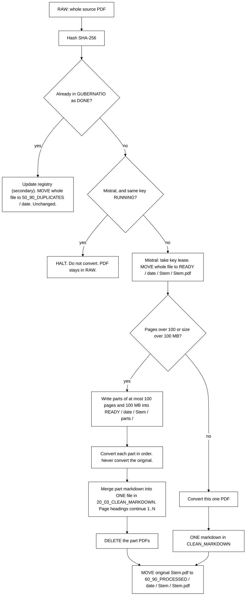

# Satyagraha Law Group

**PDF to Markdown**  ·  SLIP  ·  Legal Research  ·  Practitioner-Scholar

आ नो भद्राः क्रतवो यन्तु विश्वतः

*Let noble thoughts come to us from every side. — Rig Veda*

*The law is reason, free from passion.*

[https://www.satyagraha.com](https://www.satyagraha.com)

> This is a research project at Satyagraha Law Group as part of its pursuit of excellence in legal research. It is not legal advice, not a solicitation, and not an offer to represent anyone.

---
<!-- Related documents: Obsidian wiki links AND GitHub relative links -->
<!-- [[README]] [[Mistral-Engine-Guide]] [[Marker-Mistral-Engine]] [[Product-Requirements-Spec]] [[System-Design-Document]] [[Implementation-Plan-Guide]] [[System-Architecture-Diagram]] [[Process-Workflow-Guide]] -->

## Related documents

- [[README]] — [Product overview](../README.md)
- [[Mistral-Engine-Guide]] — [Lawyer user guide](Mistral-Engine-Guide-v1-03-09-2026-04-39-31.md)
- [[Marker-Mistral-Engine]] — [Mistral engine mapping](Marker-Mistral-Engine-v1-03-09-2026-04-05-21.md)
- [[Product-Requirements-Spec]] — [Requirements](Product-Requirements-Spec-v1-02-09-2026-22-55-00.md)
- [[System-Design-Document]] — [Design](System-Design-Document-v1-02-09-2026-22-55-00.md)
- [[Implementation-Plan-Guide]] — [Plan](Implementation-Plan-Guide-v1-02-09-2026-22-55-00.md)
- [[System-Architecture-Diagram]] — [Architecture](System-Architecture-Diagram-v1-02-09-2026-22-55-00.md)
- [[Process-Workflow-Guide]] — [Workflow](Process-Workflow-Guide-v1-02-09-2026-22-55-00.md)
- [[Slip-Markdown-Glossary]] — [Glossary](Slip-Markdown-Glossary-v1-03-09-2026-08-35-00.md)
# Process Workflow Guide

**Satyagraha Law Group**  
**Product:** SLIP PDF to Markdown Ingestion Tool  
**Family:** SLIP — Satyagraha Law Group Legal Intelligence Platform  
**Document:** Process-Workflow-Guide-v1-02-09-2026-22-55-00  
**Audience:** lawyers, clerks, and any LLM executing the playbooks

---

## 1. Happy path (ingestion)

1. Put one or more PDFs into `0_01_RAW_PDF`.
2. Run `slip-pdf-md convert --vault <SLIP root>` (or drop the file on the Phase 2 web page and wait).
3. Open the sibling file in `20_03_CLEAN_MARKDOWN`.

If you use an LLM, start at `playbooks/01-Deploy-Scaffold.md` with  
`{{REPO_URL}} = https://github.com/Satyagraha-Law-Group/pdf-to-markdown`.

That is the entire lawyer-facing workflow. The rest of this guide is what happens inside, including the 100-page / 100 MB split at Ready for Doc Link, duplicates, retries, and `NEEDS_REVIEW`.





---

## 2. End-to-end sequence

```
drop PDF
  → SHA-256
    → route (MOVE RAW → READY, or MOVE to DUPLICATES)
      → split at READY if over 100 pages or 100 MB
        → convert parts (or the one file)
          → merge markdown if split, then DELETE parts
            → 20_03_CLEAN_MARKDOWN
            → original to 60_90_PROCESSED / date / Stem
```

### Step A — Drop

A human or watcher places files in `0_01_RAW_PDF`. Nested subfolders are allowed; the converter walks them recursively. Do not rename the folder.

### Step B — Hash

For each `*.pdf` the tool reads all bytes and computes SHA-256. The hash is the document. The filename is a caption. Two files named `IPC.pdf` and `ipc (1).pdf` with identical bytes are **one** document.

### Step B2 — GUBERNATIO

**GUBERNATIO** is the proper Latin noun meaning *the system of governance, steering, direction, and administration*.

Immediately after the hash, including when the hash is already `DONE`, convert appends a `GUBERNATIO` row for **this filename** plus the registry-like fields. `documents` is not given a second identity row. That is how several agents, on several devices, can process many files without clogging the registry. When convert finishes, both `documents` and GUBERNATIO are updated.

### Step C — Route

| Registry says | Route | Convert? |
| --- | --- | --- |
| never seen | **MOVE** to `10_02_READY_FOR_DOCLING / YYYY-MM-DD / Stem / Stem.pdf`; status `NEW` then `PROCESSING` | Yes |
| `DONE` | **MOVE** whole file to `50_90_DUPLICATES / YYYY-MM-DD` plus sidecar. No split. Not copied to processed | **No** |
| `PROCESSING` (crash) | do not create a second row; resume | Yes, once |
| `NEEDS_REVIEW` | keep one row; retry writes a new attempt | Yes, replacing the review file on success |

Sidecar contents (Markdown):

- duplicate filename
- SHA-256
- first-seen original filename
- path to canonical Markdown if `DONE`
- timestamp (Asia/Calcutta)

The duplicate **file is not deleted**. No playbook, CLI flag, or "smart cleanup" removes it.

### Step C2 — Split at Ready for Doc Link

Any PDF about to be converted must be at most **100 pages** and at most **100 MB**. The split happens in `10_02_READY_FOR_DOCLING`, not in RAW.

- If the file is under both caps: convert that one PDF.
- If it is over either cap: write part PDFs of at most 100 pages and 100 MB into `Stem / parts /`. Convert each part in order. Never convert the original.
- Merge the part markdown into **one** file. Page headings continue `## Page 1` .. `N`.
- After a clean merge, **delete** the part PDFs.
- Move the original `Stem.pdf` to `60_90_PROCESSED / YYYY-MM-DD / Stem / Stem.pdf`.

Duplicates never reach this step.

### Step D — Convert

Engine order per page:

1. `find_tables` → pipe table if cells are real.
2. PDF text layer → paragraphs.
3. Tesseract OCR if the text layer is empty.
4. Tesseract TSV buckets if a grid is suspected.
5. `UNRECOVERED TABLE REGION` callout if a grid is suspected but cells cannot be recovered.

Then:

- YAML front matter (`document_type`, `source_file`, `source_sha256`, `processing_status`, `engine`, `page_count`, `converted_at`).
- `## Page N` for every page.
- Leader collapse.
- Running headers to HTML comments.
- Optional `--repair-citations`.

Windows OCR binary: `C:\Program Files\Tesseract-OCR\tesseract.exe`.

### Step E — Write

- Success → `20_03_CLEAN_MARKDOWN/{stem}.md`, status `DONE`, original PDF moved to `60_90_PROCESSED / YYYY-MM-DD / Stem / Stem.pdf`. Split parts deleted.
- Failure or empty extract the engine will not stand behind → `70_99_NEEDS_REVIEW/`, status `NEEDS_REVIEW`.

Layer 2 folders `30_04_CASE_BRIEFS` and `40_05_PROJECT_BRIEFS` are not written.

### Step F — Audit flags

`slip-pdf-md audit` walks clean Markdown and review folders and flags:

| Flag | Meaning | Typical action |
| --- | --- | --- |
| `MISSING_FRONT_MATTER` | File is not a product output | Re-run convert or ignore stray files |
| `HASH_MISMATCH` | Front matter SHA ≠ registry | Treat as `NEEDS_REVIEW` |
| `NO_PAGE_HEADINGS` | Lost page contract | Re-run convert |
| `EMPTY_BODY` | Ingestion produced a blank | Scan quality / OCR doctor |
| `UNRECOVERED_TABLE` | Honest gap in a grid | Human or playbook 05; do not invent cells |
| `ORPHAN_DONE` | Status `DONE` but Markdown missing | Repair status or retry under review rules |
| `STALE_PROCESSING` | Crash residue | Resume convert |

Audit writes `Audit-Quality-Report-vN-DD-MM-YYYY-HH-MI-SS.md` (three Title-Case words, 24-hour Asia/Calcutta).

---

## 3. Duplicates in practice

Scenario: clerk drops `Contract-Scan.pdf`. Convert succeeds. Later a lawyer drops `contract scan (final).pdf` with the same bytes.

What the lawyer sees:

- `20_03_CLEAN_MARKDOWN/Contract-Scan.md` — unchanged, still the only conversion.
- `50_90_DUPLICATES/contract scan (final).pdf` — the second physical file, kept.
- `50_90_DUPLICATES/contract scan (final).pdf.sidecar.md` — explains why it was not converted again.

What never happens:

- Silent overwrite of the Markdown with a second slightly different OCR.
- Deletion of the second PDF because "we already have it".
- A new registry row.

If the second file is **not** the same bytes (re-scan, different crop), it is a new hash and converts independently. That is correct: it is a different photocopy.

---

## 4. Retries

| Starting status | Command | Result |
| --- | --- | --- |
| `DONE` | `convert` again with the same file still in RAW (or re-dropped) | Duplicate path; Markdown untouched |
| `DONE` | `convert --force` is **not provided** in Phase 1 | Avoid accidental double-convert. Re-convert requires flipping status via a documented review path |
| `NEEDS_REVIEW` | `convert` | Engine runs once more; success promotes to `20_03` and `DONE` |
| `PROCESSING` | `convert` after crash | Resume; still one Markdown target |
| `NEW` | n/a | Immediately moves to `PROCESSING` |

There is no `--force` in this sprint on purpose. Double-convert of a `DONE` hash is a defect.

---

## 5. NEEDS_REVIEW vs CLEAN_MARKDOWN

`20_03_CLEAN_MARKDOWN` is the lawyer-trusted tray. Anything in it should have front matter `processing_status: DONE`.

`70_99_NEEDS_REVIEW` is the exception tray. Reasons include:

- Tesseract missing on a scanned page.
- Exception inside PyMuPDF.
- Zero pages of recoverable text.
- Audit-promoted files (`EMPTY_BODY`, `HASH_MISMATCH`).

A human (or playbook 05) inspects review files. They may:

- Install Tesseract and retry.
- Supply a better scan.
- Manually type a table and leave an editorial note. The tool itself will not guess the table.

---

## 6. Web workflow (Phase 2)

1. Open http://127.0.0.1:8000
2. Drop a PDF on the page.
3. The browser `POST`s `/jobs` and polls `GET /jobs/{id}`.
4. When status is `DONE`, download Markdown.
5. If a SLIP vault is configured, the same routing rules apply (duplicates included). If not, the job uses an isolated mini-vault so the page still works on a developer laptop.

`GET /health` is for operators and CI, not for lawyers.

---

## 7. First-time vault workflow

```
python scripts/deploy.py --vault "D:\satyagraha\VAULT\Satyagraha Law Group"
```

or, if the SLIP root already exists:

```
python scripts/deploy.py --vault "D:\satyagraha\VAULT\Satyagraha Law Group\SLIP_DOCUMENT_PROCESSING"
```

Deploy creates folders, installs the package, and writes `Lawyer-Instruction-Guide-v1-…md` beside the tool. Then return to §1.

---

## 8. Filename convention for generated docs and logs

Exactly three Title-Case words, hyphens only, no underscores, no spaces, four-digit year, 24-hour Asia/Calcutta:

`Word1-Word2-Word3-vN-DD-MM-YYYY-HH-MI-SS.ext`

Examples:

- `Audit-Quality-Report-v1-02-09-2026-22-55-00.md`
- `Lawyer-Instruction-Guide-v1-02-09-2026-22-55-00.md`

Do **not** rename pipeline folders `0_01_RAW_PDF` and siblings to fit this convention. Those names are the SLIP contract.

---

## 9. Stop conditions (for humans and agents)

Stop and ask a lawyer before:

- Deleting anything from `50_90_DUPLICATES`.
- Sending a client PDF to a cloud OCR API.
- Committing a PDF or `MASTER_MACDONE.md` to git.
- Force-pushing `main`.
- Filling `30_04_CASE_BRIEFS` from this tool.

The SLIP PDF to Markdown Ingestion Tool copies. It does not advocate, brief, or shred.

---

Satyagraha Law Group publishes a SLIP PDF to Markdown Ingestion Tool. It does not publish a library.

**Satyagraha Law Group**  ·  SLIP PDF to Markdown Ingestion Tool  ·  SLIP

Founded by Anil B. (Lawyer), Satyagraha Law Group provides legal services for seekers looking for help by searching for Corporate Law, Civil Law, Criminal Law, Writs, High Court Lawyer, NRI Lawyer, Lawyer In Hyderabad, India.

Need Legal Help. [Click here](https://calendly.com/anil-satyagraha/15min).

आ नो भद्राः क्रतवो यन्तु विश्वतः

*Let noble thoughts come to us from every side. — Rig Veda*

*The law is reason, free from passion.*

> This is a research project at Satyagraha Law Group as part of its pursuit of excellence in legal research. It is not legal advice, not a solicitation, and not an offer to represent anyone.

[https://www.satyagraha.com](https://www.satyagraha.com)

This site is built from **real-world experience helping clients seeking Justice**, case by case — based on our work involving Legal Research, Drafting, Pleadings, Representation and beyond.

Explore further: [Website](https://www.satyagraha.com) · [YouTube](https://www.youtube.com/@satyagrahalawgroup2002) · [Udemy Courses](https://www.udemy.com/user/anil-b-23/) · [LinkedIn](https://www.linkedin.com/in/anilsatyagraha/) · [Facebook](https://www.facebook.com/satyagrahalawgroup) · [Twitter / X](https://twitter.com/_satyagraha) · [WordPress](https://satyagrahalawgroup.wordpress.com/) · [Instagram](https://www.instagram.com/satyagrahalawgroup/) · [Pinterest](https://in.pinterest.com/satyagrahalawgroup/) · [Tumblr](https://www.tumblr.com/blog/satyagrahalawgroup) · [SoundCloud](https://soundcloud.com/satyagrahalawgroup) · [Podomatic](http://anil-satyagraha.podomatic.com/) · [Newsletter](https://satyagraha.substack.com/) · [WhatsApp](https://api.whatsapp.com/send?phone=917095776633)

Need Legal Help? [Click Here For Next Steps](https://calendly.com/anil-satyagraha/15min)
