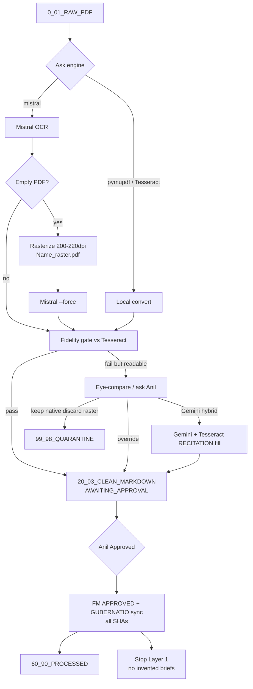

# Satyagraha Law Group

**PDF to Markdown** · SLIP · Legal Research · Practitioner-Scholar

आ नो भद्राः क्रतवो यन्तु विश्वतः

*Let noble thoughts come to us from every side. — Rig Veda*

*The law is reason, free from passion.*

[https://www.satyagraha.com](https://www.satyagraha.com)

> This is a research project at Satyagraha Law Group as part of its pursuit of excellence in legal research. It is not legal advice, not a solicitation, and not an offer to represent anyone.

---

# System architecture — Convert-PDF-TO-MARKDOWN-01 (post-GODI)

**Stamp:** `SLG-System-Architecture-v-1-0-19-09-2026-18-35-03.md`  
**Prior:** `System-Architecture-Diagram-v1-02-09-2026-22-55-00.md`

## Pipeline (Layer 1 only)

## Control plane
- **GUBERNATIO** SQLite registry (hash, status, paths) under `90_00_PROJECT_TOOLING\pdf-to-markdown\`
- **SECRETS.txt** / mcp-secrets for Mistral + Gemini (never log values)
- **LATEST-*** pointers under tool root for learnings, ops playbook, error addendum

## Related stamped docs
- Learnings: `SLG-Convert-Learnings-v-1-0-19-09-2026-18-35-03.md`
- Ops: `SLG-Ops-Playbook-v-1-0-19-09-2026-18-35-03.md`
- Errors: `SLG-Error-Addendum-v-1-0-19-09-2026-18-35-03.md`

---

Satyagraha Law Group publishes a SLIP PDF to Markdown Ingestion Tool. It does not publish a library.

**Satyagraha Law Group** · SLIP PDF to Markdown Ingestion Tool · SLIP

आ नो भद्राः क्रतवो यन्तु विश्वतः

*Let noble thoughts come to us from every side. — Rig Veda*

*The law is reason, free from passion.*

> This is a research project at Satyagraha Law Group as part of its pursuit of excellence in legal research. It is not legal advice, not a solicitation, and not an offer to represent anyone.

[https://www.satyagraha.com](https://www.satyagraha.com)

## Convert-run mutex (added 19-09-2026-21-52-02)

Only one `convert` at a time: **CONVERT.lock** in `_runtime-state` plus SQLite **CONVERT_LEASE**. See `docs/LATEST-Convert-Run-Mutex.md`. Distinct from **GUBERNATIO** per-document / API-key leasing.
