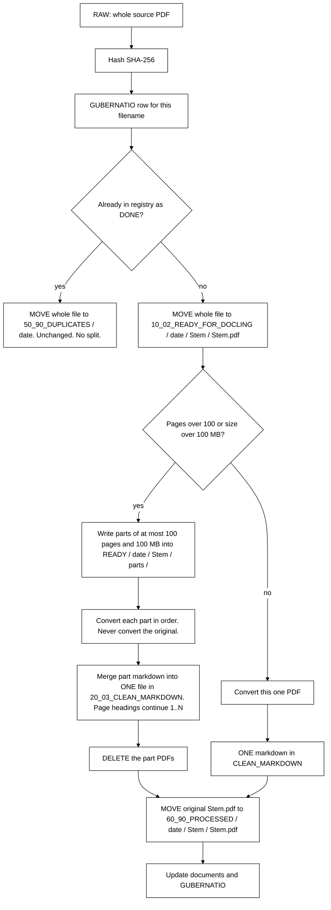
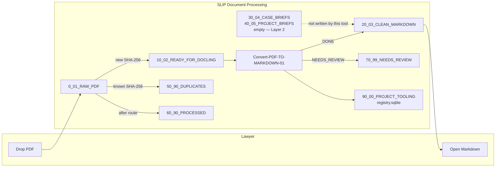
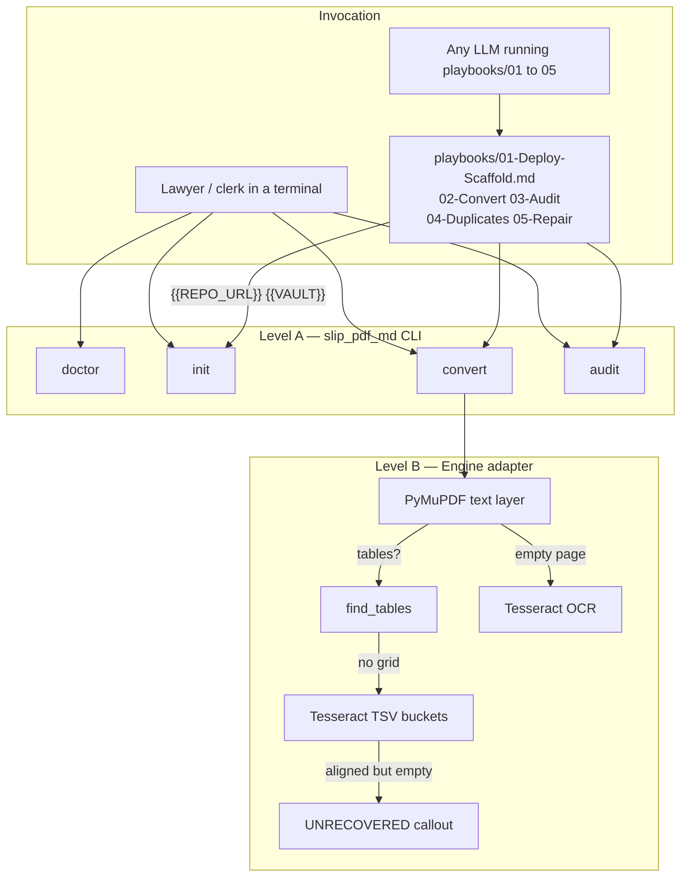
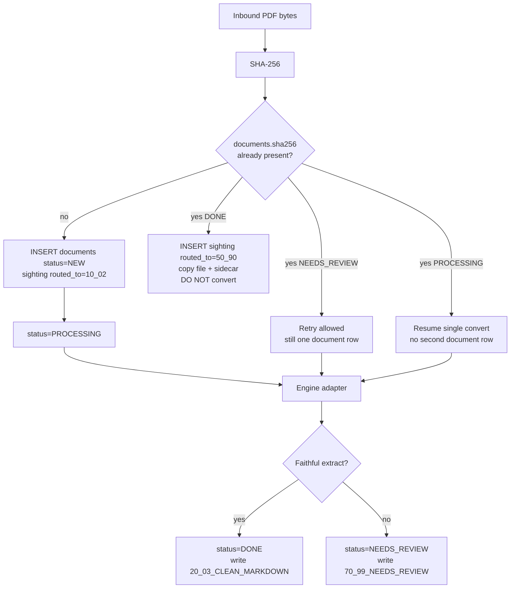
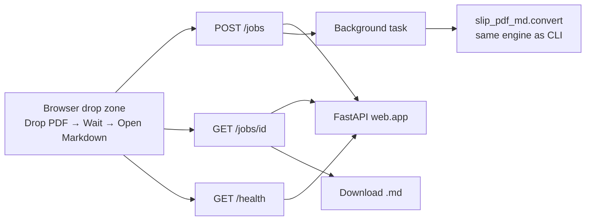
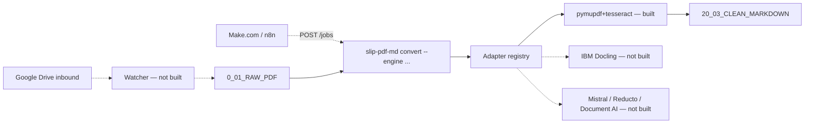
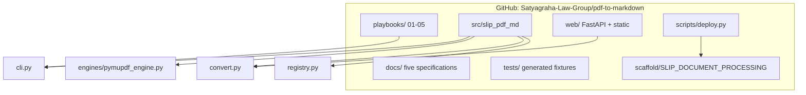

# Satyagraha Law Group

**PDF to Markdown**  ·  SLIP  ·  Legal Research  ·  Practitioner-Scholar

आ नो भद्राः क्रतवो यन्तु विश्वतः

*Let noble thoughts come to us from every side. — Rig Veda*

*The law is reason, free from passion.*

[https://www.satyagraha.com](https://www.satyagraha.com)

> This is a research project at Satyagraha Law Group as part of its pursuit of excellence in legal research. It is not legal advice, not a solicitation, and not an offer to represent anyone.

---
<!-- Related documents: Obsidian wiki links AND GitHub relative links -->
<!-- [[README]] [[Mistral-Engine-Guide]] [[Marker-Mistral-Engine]] [[Product-Requirements-Spec]] [[System-Design-Document]] [[Implementation-Plan-Guide]] [[System-Architecture-Diagram]] [[Process-Workflow-Guide]] -->

## Related documents

- [[README]] — [Product overview](../README.md)
- [[Mistral-Engine-Guide]] — [Lawyer user guide](Mistral-Engine-Guide-v1-03-09-2026-04-39-31.md)
- [[Marker-Mistral-Engine]] — [Mistral engine mapping](Marker-Mistral-Engine-v1-03-09-2026-04-05-21.md)
- [[Product-Requirements-Spec]] — [Requirements](Product-Requirements-Spec-v1-02-09-2026-22-55-00.md)
- [[System-Design-Document]] — [Design](System-Design-Document-v1-02-09-2026-22-55-00.md)
- [[Implementation-Plan-Guide]] — [Plan](Implementation-Plan-Guide-v1-02-09-2026-22-55-00.md)
- [[System-Architecture-Diagram]] — [Architecture](System-Architecture-Diagram-v1-02-09-2026-22-55-00.md)
- [[Process-Workflow-Guide]] — [Workflow](Process-Workflow-Guide-v1-02-09-2026-22-55-00.md)
# System Architecture Diagram

**Satyagraha Law Group**  
**Product:** SLIP PDF to Markdown Ingestion Tool  
**Family:** SLIP — Satyagraha Law Group Legal Intelligence Platform  
**Document:** System-Architecture-Diagram-v1-02-09-2026-22-55-00  
**Notation:** Mermaid flowcharts plus a black-on-white PNG of the happy path. These diagrams are the contract for implementers.

---

## 0. Convert happy path (split at READY)

White background, black type, black borders.

## 1. SLIP folder flow

The lawyer only sees the left-most drop and the right-most Markdown. Everything in the middle is the tool's internals.

---

## 2. Phase 1 — local CLI and LLM playbooks

Playbook invocation is parameterized: the agent is told the GitHub URL `https://github.com/Satyagraha-Law-Group/pdf-to-markdown` and the vault path. It does not scrape credentials. It does not push client files.

---

## 3. SHA-256 registry

Filename is a label. Bytes are identity.

Registry location: `90_00_PROJECT_TOOLING/pdf-to-markdown/registry.sqlite`. Unique primary key on `sha256`. Retries must not double-convert `DONE` hashes.

---

## 4. Phase 2 — web (same engine)

Default bind `127.0.0.1:8000`. One-liner:

`uvicorn web.app:app --reload --host 127.0.0.1 --port 8000`

---

## 5. Phase 2b — managed Drive / Make.com / Docling (design only)

This diagram is a **future** topology. No code in this sprint implements the dashed nodes.

---

## 6. Component view (packages on disk)

---

Satyagraha Law Group publishes a SLIP PDF to Markdown Ingestion Tool. It does not publish a library.

**Satyagraha Law Group**  ·  SLIP PDF to Markdown Ingestion Tool  ·  SLIP

Founded by Anil B. (Lawyer), Satyagraha Law Group provides legal services for seekers looking for help by searching for Corporate Law, Civil Law, Criminal Law, Writs, High Court Lawyer, NRI Lawyer, Lawyer In Hyderabad, India.

Need Legal Help. [Click here](https://calendly.com/anil-satyagraha/15min).

आ नो भद्राः क्रतवो यन्तु विश्वतः

*Let noble thoughts come to us from every side. — Rig Veda*

*The law is reason, free from passion.*

> This is a research project at Satyagraha Law Group as part of its pursuit of excellence in legal research. It is not legal advice, not a solicitation, and not an offer to represent anyone.

[https://www.satyagraha.com](https://www.satyagraha.com)

This site is built from **real-world experience helping clients seeking Justice**, case by case — based on our work involving Legal Research, Drafting, Pleadings, Representation and beyond.

Explore further: [Website](https://www.satyagraha.com) · [YouTube](https://www.youtube.com/@satyagrahalawgroup2002) · [Udemy Courses](https://www.udemy.com/user/anil-b-23/) · [LinkedIn](https://www.linkedin.com/in/anilsatyagraha/) · [Facebook](https://www.facebook.com/satyagrahalawgroup) · [Twitter / X](https://twitter.com/_satyagraha) · [WordPress](https://satyagrahalawgroup.wordpress.com/) · [Instagram](https://www.instagram.com/satyagrahalawgroup/) · [Pinterest](https://in.pinterest.com/satyagrahalawgroup/) · [Tumblr](https://www.tumblr.com/blog/satyagrahalawgroup) · [SoundCloud](https://soundcloud.com/satyagrahalawgroup) · [Podomatic](http://anil-satyagraha.podomatic.com/) · [Newsletter](https://satyagraha.substack.com/) · [WhatsApp](https://api.whatsapp.com/send?phone=917095776633)

Need Legal Help? [Click Here For Next Steps](https://calendly.com/anil-satyagraha/15min)
