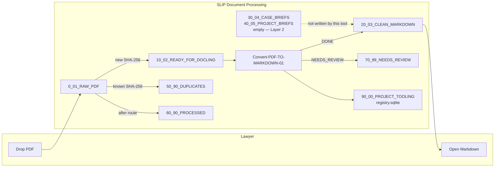
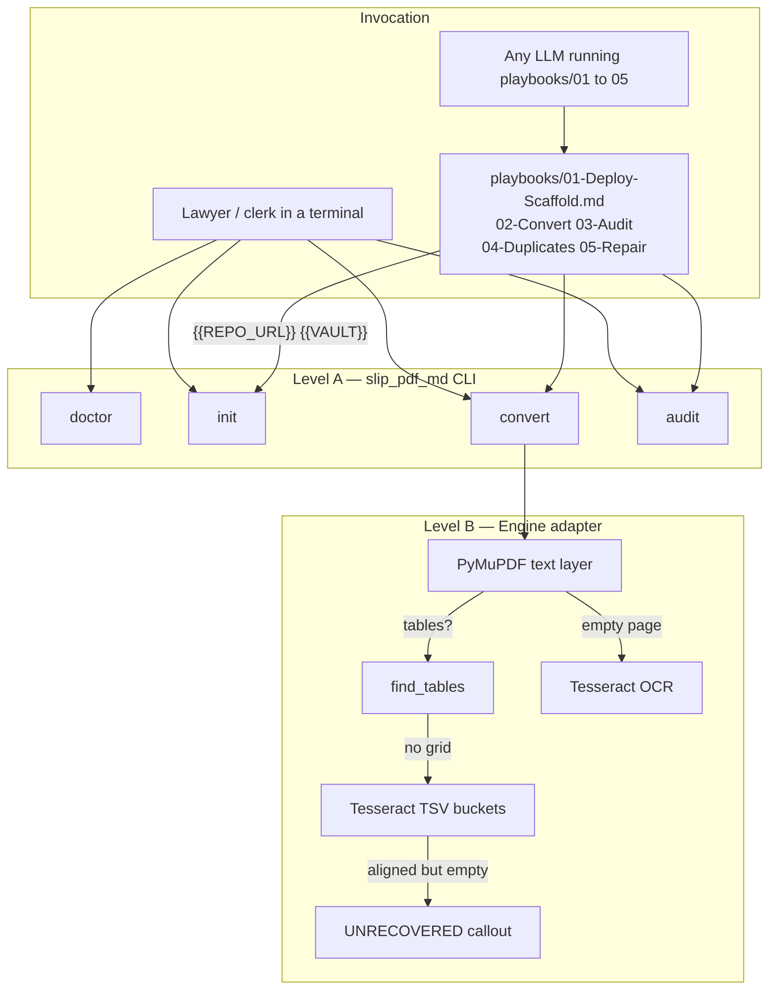
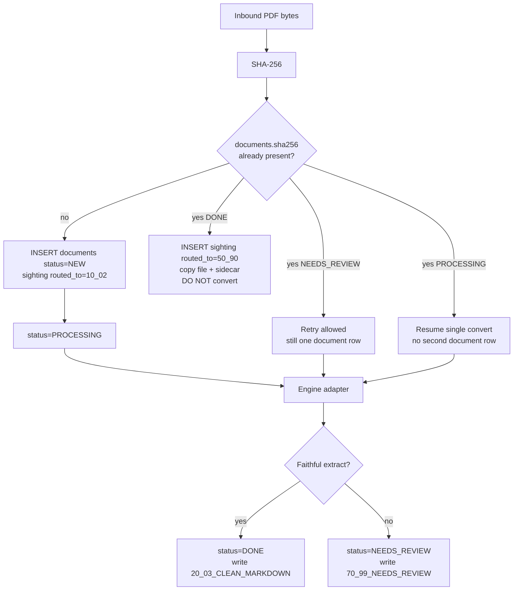
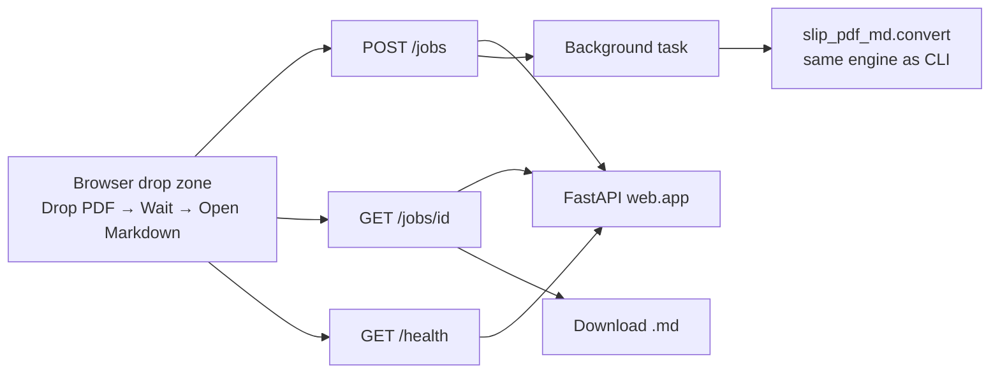
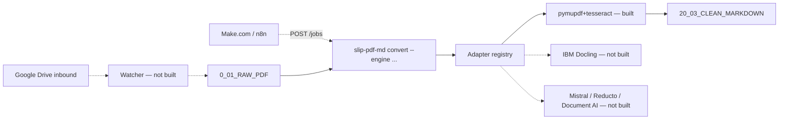
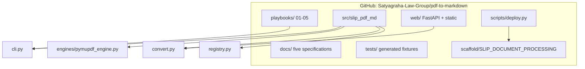
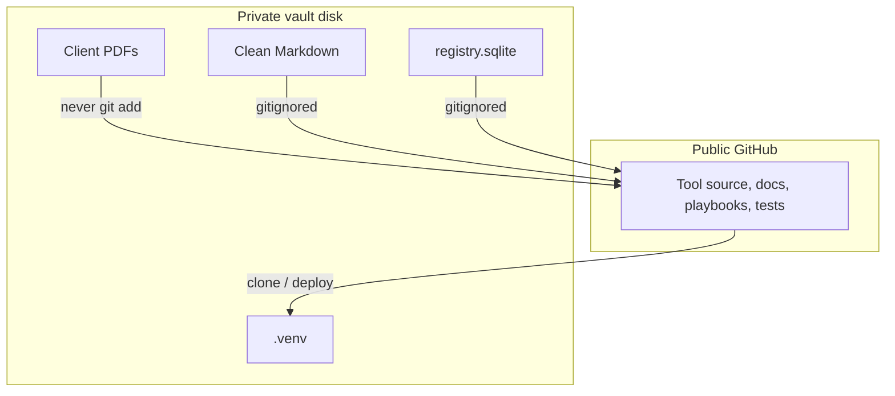

# System Architecture Diagram

**Satyagraha Law Group**  
**Product:** PDF to Markdown  
**Family:** SLIP — Satyagraha Law Group Legal Intelligence Platform  
**Document:** System-Architecture-Diagram-v1-02-09-2026-22-55-00  
**Notation:** Mermaid flowcharts. These diagrams are the contract for implementers.

---

## 1. SLIP folder flow

The lawyer only sees the left-most drop and the right-most Markdown. Everything in the middle is the photocopier's internals.

---

## 2. Phase 1 — local CLI and LLM playbooks

Playbook invocation is parameterized: the agent is told the GitHub URL `https://github.com/Satyagraha-Law-Group/pdf-to-markdown` and the vault path. It does not scrape credentials. It does not push client files.

---

## 3. SHA-256 registry

Filename is a label. Bytes are identity.

Registry location: `90_00_PROJECT_TOOLING/pdf-to-markdown/registry.sqlite`. Unique primary key on `sha256`. Retries must not double-convert `DONE` hashes.

---

## 4. Phase 2 — web (same engine)

Default bind `127.0.0.1:8000`. One-liner:

`uvicorn web.app:app --reload --host 127.0.0.1 --port 8000`

---

## 5. Phase 2b — managed Drive / Make.com / Docling (design only)

This diagram is a **future** topology. No code in this sprint implements the dashed nodes.

---

## 6. Component view (packages on disk)

---

## 7. Trust boundary

Satyagraha Law Group publishes a photocopier. It does not publish a library.
